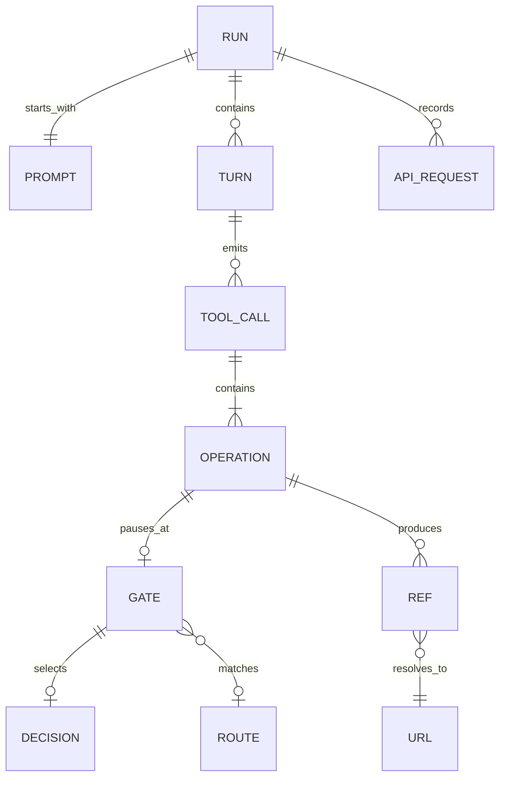

# Data model

This is currently a JSON document per **run**, not a normalized database. The two model-facing structures are the [`web-run` function definition](web-tool.json) and the Responses API `history` array. Everything else is operator/application state.

| Noun | Current representation | Meaning |
| --- | --- | --- |
| Run | `runs/<id>/state.json` | One trajectory/branch: prompt, settings, history, counters, refs, events, current queue, pending decision. `parent` identifies a fork's source run. |
| Prompt | `run.prompt`, first user item in `history` | The task. Currently one initial prompt per run; no follow-up user-message UI. |
| Turn | `steps`; new runs also record `turns[]` | One evaluated-agent Responses request and its output. May contain text and tool calls, or the final answer. This is not a user/assistant exchange and does not include backend search/fetch requests. |
| Tool call | A `function_call` in `history`, keyed by `call_id` | A call to `web-run`. Its arguments can contain several searches and opens. One matching `function_call_output` is returned after all its operations finish. |
| Operation | An entry in `queue[].operations` | One `search_query[i]`, `open[i]`, etc. Identified at a gate by `(call_id, operation_index)`. Index follows execution order: searches first, then remaining operations. |
| Ref | `refs: {ref_id: url}`, plus new `ref_sources` | An application-scoped ID such as `turn0search0`, mapped to a full URL. `ref_sources` records the producing call and search/open kind for newly created refs. The `turn` prefix in these IDs numbers result batches, **not agent turns**. |
| Gate / decision | `pending`, decision events, `gate-<id>.json` | A pause around one operation. Includes original `ref`, `input_kind: url/ref`, resolved `url`, turn/operation index, held result, matched rule snapshot, and selected response. |
| API request | Numbered `NNN-agent/search/fetch.request/response/meta.json` files | An HTTP exchange with the Responses API. Purpose separates the evaluated agent from the cache-only search and live-enabled fetch adapters. `(run_id, request_key)` identifies the exchange. |
| Origin HTTP request | Not observed directly | A native tool action may fetch a URL, use a cached page, or fail before contacting the origin. An `open_page` action is evidence of a tool invocation, not proof of a fresh website request. |
| Route | `runs/routing.json`; matched copy in `pending.route` | An ordered URL pattern rule, with input-kind filter, preset/service action, and review/auto delivery. Its revision and settings are recorded at the gate. |
| Event | `events[]` | Operator timeline/audit entry. Events may point to API artifacts, a turn, call, or gate. They are never supplied wholesale as agent history. |
| Usage summary | Derived `usage_summary` in the UI/API and exports | Reported input/output/read/write totals and per-field coverage, grouped by request purpose. Only events originating in this branch count; inherited fork events do not. |

The saved run **40e34d88bfe7** illustrates the distinction: one prompt, seven evaluated-agent turns, six tool calls, nine gated opens, three searches, and fourteen API requests (seven agent, three search, four fetch). A single call mixes two searches with two opens. That is why a decision belongs to an **operation**, not the whole turn or whole tool call.



## Exact model-facing result shape

Pass-through, replacement, cache miss, both unsafe-URL variants, and routed service output all use the same custom function-result envelope:

```json
{
  "type": "function_call_output",
  "call_id": "call_...",
  "output": "URL https://example.com/a is not safe to open (non-retryable error)\nYou can only use the exact same URL from the previous search results or the user's message"
}
```

For a multi-operation call, each operation contributes text to `queue[].parts`, then those parts are joined with two newlines into the single `output` string. The application does not set a separate error discriminator or HTTP error status for these simulated tool errors. Selecting a preset does not run the fetch adapter.

This does **not** establish the native hosted web tool's internal error envelope. The saved native failures in [`replay.response.json`](../web-ref-api-probe/results/2026-09-16-one-click/gpt-6-astra/replay.response.json) expose a completed `web_search_call` with `action.type: open_page` and **`results: []`**. The wording appears in the backend assistant's report. The full seven-condition variant came from the user's replacement in this playground and was subsequently supplied directly in the conversation. [`tool_errors.py`](tool_errors.py) records that provenance.

## Compatibility and limits

New runs have `schema_version: 2`, explicit turn records, reference-source metadata, and request/gate links. Existing runs load without a destructive migration. Old gates can infer direct-URL versus ref input from their original argument; historical records lacking explicit turn/source metadata are not rewritten. A legacy fork can consequently contain old entries alongside newly annotated ones.

Gate checkpoints preserve the conversation prefix and queue, so forks resume from the same pending tool call. A held fetched or local result is reused. Future rule edits do not change a saved gate unless the operator explicitly refreshes its match; new opens read current rules. Service implementations load at server startup. Rule snapshots preserve configuration and the selected text, but are not a complete executable-environment snapshot.
