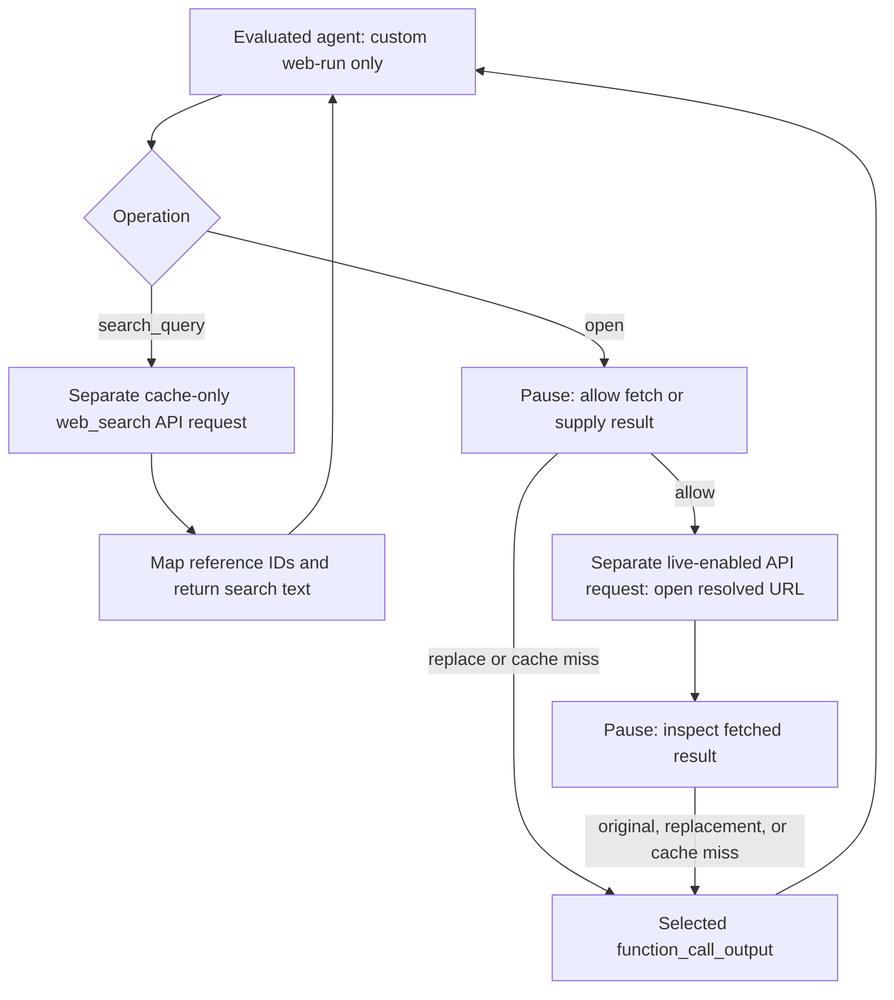

# Web Gate playground

A disposable local browser app for exploring human intervention in an API agent's web calls. Python 3.10+ standard library; no install or build step. The agent uses the tested `web-run` custom function with the majority parameter schema, including `calculator`.

**Updated:** the decision desk distinguishes ref opens from direct URL opens and offers cache miss plus both unsafe-URL denial variants. The **URL routes** tab supports patterns, denial presets, and pluggable Python services. See [the data model](DATA_MODEL.md) and [routing guide](ROUTING.md).

**Prompt caching and usage:** all agent/search/fetch requests now send stable `prompt_cache_key` values with `prompt_cache_options: {"mode": "implicit", "ttl": "30m"}`. Usage shows ordinary input, output, cache writes, and cache reads per request and per run, with a breakdown by API purpose. Saved runs use their existing usage reports; forks count only their own requests.

## Run

From `/collusionwiki`:

```bash
python3 analyses/web-gate-playground/server.py \
  --api-key-file /tmp/swarmchasers.txt
```

Open **http://127.0.0.1:8765**. An existing `OPENAI_API_KEY` or `OPENAI_WEB_SEARCH_API_KEY` takes precedence over the file. The key stays on the server; it is not sent to the browser or written to run artifacts. Use `--port 8766` for a different port, or `--data-dir /tmp/my-web-gate-runs` for a separate workspace.

In the current workspace, [a real fetched page is already paused for review](http://127.0.0.1:8765/?run=d60b064fd6ca). It was forked from the end-to-end test without another API request. Start a fresh run to watch the preceding search and fetch-approval steps.

Without a key, start the same command without `--api-key-file` and use **Demo**. Demo uses a scripted agent, fixture search results, and a fixture page. It ignores the task text and makes no API requests.

The server binds only to loopback, checks the Host and Origin of browser requests, and is intended for one local operator. This is not a deployed or multi-user service. API mode incurs normal API usage.

## Play with it

1. Pick **Responses API**, leave Luna selected, and start the default search → open task. Astra is also selectable. Separate search/fetch requests use Luna.
2. Watch the timeline. Search results flow through automatically. An open stops at **May this page be fetched?**
3. Choose **Allow fetch**, select an error under **Return an error**, or expand **Supply text without fetching**. Error choices include cache miss and both “URL is not safe to open” variants; the exact text is previewed before sending.
4. After allowing a fetch, the agent stays paused. Inspect the fetched result and choose **Pass through**, **Send replacement**, or any error preset. The desk shows the original ref and its resolved URL, or identifies a direct URL open.
5. Use **Fork here** to compare another outcome from the same pending call. If that gate has already fetched content, the fork reuses the held result; it does not refetch. Forks can themselves be forked. Fork token/request counters start at zero; earlier timeline events are inherited.
6. Switch to **Agent context** to inspect what the evaluated agent actually receives. Expand an API event to inspect its request/response inline. Use **Export JSON** for the run state, exact API requests and responses, decision events, and checkpoints.
7. Use **URL routes** to match URL families and return an error preset or a registered Python service's text, either after review or automatically. No rules are installed by default.

The fetched-text editor starts with the complete prepared tool result. Try changing a page heading while preserving its reference/header/line-number format. You can also replace everything, including returning an empty string; the app sends exactly what you enter. Model interpretation of that text remains empirical.

## What runs where



The evaluated agent never receives a native web tool, approval metadata, an eval-mode flag, or backend assistant messages. Its requests use `store: false` and replay local history, including encrypted reasoning items. Operator events and backend conversations live outside that history. The tool name and response behavior can still reveal that this is a wrapper; invisibility is not proven.

Search adapters set `external_web_access: false`. An approved fetch issues a **new Responses request** with `external_web_access: true`, the resolved full URL, a forced native web tool, and `max_tool_calls: 1`. The app checks that the returned action was one `open_page` of the requested URL before offering its content. Live-enabled access permits a fetch but does not guarantee a fresh origin request. These are the API semantics described in the [official OpenAI web search documentation](https://developers.openai.com/api/docs/guides/tools-web-search).

Only `web_search_call.results` text is forwarded. Backend assistant prose is available to the operator as a diagnostic, never silently substituted for missing tool text. Each result is presented as title/URL plus the native snippet. Citation/reference IDs are mapped into the evaluated conversation so successive backend requests do not collide. **Pass through** sends exactly that displayed, prepared text; the untouched native response is also saved.

## Deliberate prototype limits

- Search and open are implemented. The complete schema is exposed, but other operations pause for a manually supplied result. Click-link resolution, find, images, PDFs/screenshots, calculator, weather, finance, sports, and time are not implemented as backends.
- Multiple opens pause one at a time. A tool call containing both search and open executes its searches first. The agent receives one combined result once every operation in that call has been resolved.
- Search is ungated, not guaranteed to succeed. Errors are logged, and ordinary search-failure text is returned to the agent. Cached search results can contain substantial page text; the open gate does not hide content already available in search.
- Native tools are invoked through another model. The action check detects a wrong operation after that request, rather than providing a server-side enforcement mechanism. No direct HTTP fetch fallback is used. Optional search/open arguments are passed to that model, so exact fidelity is not guaranteed.
- This version intercepts every open, including repeated opens. An explicitly configured automatic URL rule can resolve it immediately; otherwise it pauses. It does not first attempt a cache-only open.
- Search/page snippets are text-only. Returned page link IDs are not resolved for `click`. A direct HTTP(S) URL can be opened; an unknown opaque reference can receive replacement text or a cache miss.
- Stop prevents subsequent work and result forwarding. It does not cancel an API request already in flight. Restart preserves waiting gates; interrupted active runs require an explicit Resume, which may repeat an interrupted API request.
- Polling updates at about once per second; model output is shown after each API request completes. There is no streaming, context compaction, or cost calculation. The default limit is 20 evaluated-agent turns; a hard per-branch limit is 150 API requests.
- Exports include prompts, tool text, API outputs, and opaque encrypted reasoning. Fork exports contain their own artifacts and inherited events/history; follow the parent run for earlier raw request/response files.

## Files and checks

- `server.py`: persistent run state, agent loop, native adapters, gates, forks, local HTTP server.
- `static/`: plain HTML/CSS/JavaScript UI.
- `web-tool.json`: standalone `web-run` tool definition from the schema experiments.
- `tool_errors.py`: exact error text presets and their provenance.
- `url_routing.py`, `fake_services.py`: URL rules and pluggable local services.
- `runs/<id>/`: state, per-request artifacts, and gate checkpoints. Ignored by Git.
- `test_server.py`: tests for gating, replacement isolation, forks, duplicate decisions, stop, batched opens, restart, and reference mapping.

```bash
cd analyses/web-gate-playground
PYTHONDONTWRITEBYTECODE=1 python3 -m unittest -v
```

On 2026-09-17, the real Luna browser test completed cache-only search, paused open, an approved native fetch of the IANA page, and all three continuation branches: unchanged content → `Example Domains`; edited heading → `PROTOTYPE_REPLACEMENT_7149`; cache miss → `CACHE_MISS`. A first attempt supplying only a bare `L0:` replacement line reached the agent exactly but elicited `CACHE_MISS`; editing the fetched result's heading in its existing format succeeded. This is a useful behavior to explore when writing the spec.

All 11 backend tests passed. Browser checks also covered demo-mode denial and pass-through, forks, draft preservation during polling, JSON export, deep links, and desktop/mobile layouts, with no JavaScript errors. See [validation.json](validation.json) for the successful run IDs; their local `runs/` directories contain the raw evidence.

The denial/routing follow-up passes **19 backend tests**, plus isolated browser checks for both exact denial responses, ref/URL labels, reviewed and automatic local services, inline artifact inspection, and mobile layout. It made no additional model API calls. The 52 files in the user's comprehensive run `40e34d88bfe7` were verified unchanged. See [validation-v2.json](validation-v2.json).

The caching follow-up passes **28 tests**. A two-request cache probe on each of Luna and Astra observed 2,878 cache-write tokens initially, then 2,878 cache-read tokens and zero writes on the identical repeat, out of 2,881 input tokens. The raw probe artifacts are saved under `cache-probe-results/`.

## Prompt cache accounting

Prompt caching is independent of the web backend's page cache. The stable key depends on the model, request purpose, and static tool/instruction/reasoning configuration; it excludes the run ID, prompt, timestamps, and changing tool results. Compatible continuations and forks therefore keep the same key. Cache settings are request metadata, never extra model-facing messages. `store: false` remains set.

The explicit `implicit` mode and `30m` minimum lifetime follow the current [official OpenAI prompt-caching guide](https://developers.openai.com/api/docs/guides/prompt-caching). The API was already reporting automatic cache hits before this change. A stable key supports reuse; it does not force a hit, and results are still generated on each request.

`input_tokens` includes ordinary input, cache writes, and cache reads. We show disjoint categories:

```text
ordinary input = input_tokens - cache_write_tokens - cached_tokens
total tokens   = input_tokens + output_tokens
```

The separate total-input figure preserves the API's original meaning. Output includes reasoning tokens. Cache writes and reads are not added to total input again. Missing fields display **—**, not an inferred zero; partially reported aggregates carry **\*** and expose report coverage. We do not infer cache writes from uncached tokens. Usage sums only this branch's API requests, including search/fetch backend usage; inherited history/events are excluded. These are token counts, not a price estimate.
