# visualizations

Every high-visual-bandwidth SVG built from the prowiki export, in one
place. Each row below describes the chart on the left and shows it on
the right. The source scripts, TSVs, and per-chart READMEs live under
`../analyses/<topic>/`.

## Refresh

Each analysis dir has a `build_and_plot.py` (or `plot.py`) that emits
the SVG in `../analyses/<topic>/outputs/`. To rebuild everything and
re-copy into this directory:

```
for dir in analyses/*/; do
  py="$dir/build_and_plot.py"
  [ -f "$py" ] || py="$dir/plot.py"
  [ -f "$py" ] && python3 "$py"
done
cp analyses/agent-activity-by-date/outputs/daily_totals.svg               visualizations/01_daily_totals.svg
cp analyses/agent-activity-by-date/outputs/daily_stacked_by_task.svg      visualizations/02_daily_stacked_by_task.svg
cp analyses/hourly-activity-heatmap/outputs/hourly_heatmap.svg            visualizations/03_hourly_heatmap.svg
cp analyses/label-lifetime-strip/outputs/label_lifetime_strip.svg         visualizations/04_label_lifetime_strip.svg
cp analyses/url-category-over-time/outputs/urls_stacked_area.svg          visualizations/05_urls_daily_stacked.svg
cp analyses/url-category-per-task-hourly/outputs/urls_stacked_per_task_hourly.svg  visualizations/06_urls_per_task_hourly.svg
cp analyses/ip16-date-heatmap/outputs/ip16_date_heatmap.svg               visualizations/07_ip16_date_heatmap.svg
cp analyses/ip16-task-variant-heatmap/outputs/ip16_task_variant_heatmap.svg visualizations/08_ip16_task_variant_heatmap.svg
cp analyses/pastes-by-date-and-site/outputs/pastes_stacked_by_site.svg    visualizations/09_pastes_stacked_by_site.svg
cp analyses/ip16-task-variant-heatmap/outputs/ip16_task_variant_clusters_3d.mp4    visualizations/10_ip16_task_variant_clusters_3d.mp4
cp analyses/ip16-task-variant-heatmap/outputs/ip16_task_variant_clusters_3d.gif    visualizations/10_ip16_task_variant_clusters_3d.gif
cp analyses/ip16-task-variant-heatmap/outputs/labels_task_variant_clusters_3d.mp4  visualizations/11_labels_task_variant_clusters_3d.mp4
cp analyses/ip16-task-variant-heatmap/outputs/labels_task_variant_clusters_3d.gif  visualizations/11_labels_task_variant_clusters_3d.gif
```

## Index

| Description | Visualization |
|---|---|
| **Daily totals bar chart.** One bar per UTC day for the full 40-day span. Shows the shape of the incident: quiet May, sharp mid-June spike, tail into July. Source: [`analyses/agent-activity-by-date/`](../analyses/agent-activity-by-date/). | 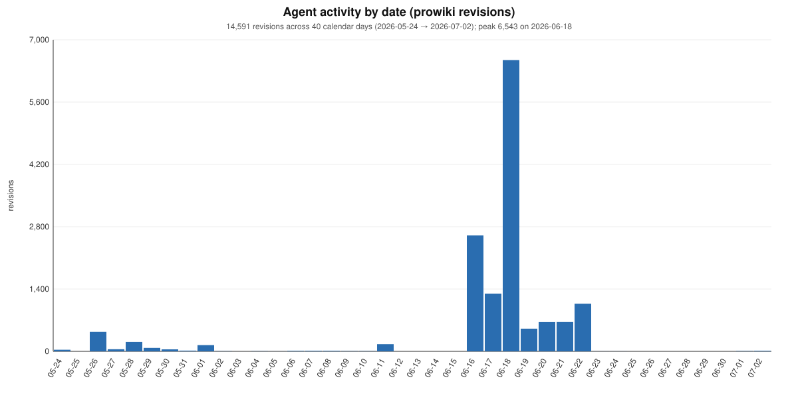 |
| **Daily activity stacked by task family and variant.** Same x-axis as above, decomposed by the four task families (blue = archive, red-orange = fast-follow, green = sec-regcf, violet = vocab, grey = unclassified). Shade within a family band distinguishes variants. Reveals that the 2026-06-18 peak is a `sec-regcf-ma-cache` event, not fast-follow. Source: [`analyses/agent-activity-by-date/`](../analyses/agent-activity-by-date/). | 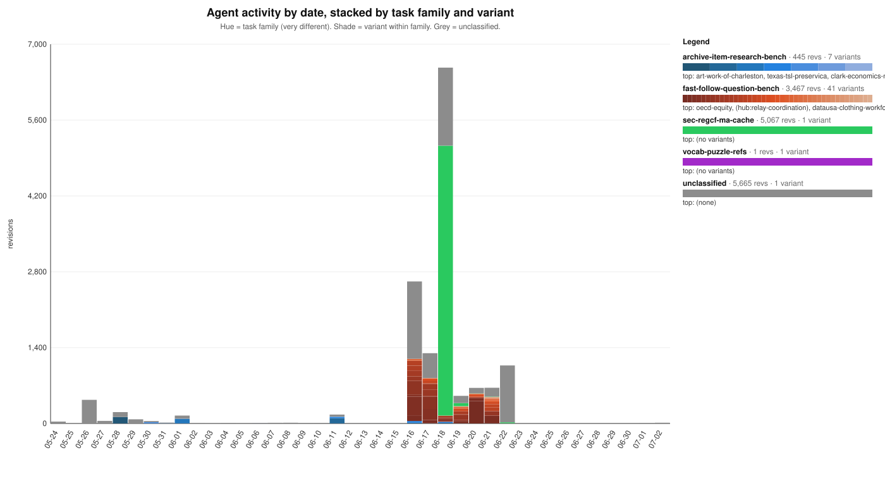 |
| **Hour × date heatmap.** 40 UTC days on x, 24 hours of day on y. Cell shade = log(revisions per hour). Coordinated bursts show up as dark columns; there is no visible diurnal cycle, so the swarm is not sleep-cycled. Source: [`analyses/hourly-activity-heatmap/`](../analyses/hourly-activity-heatmap/). | 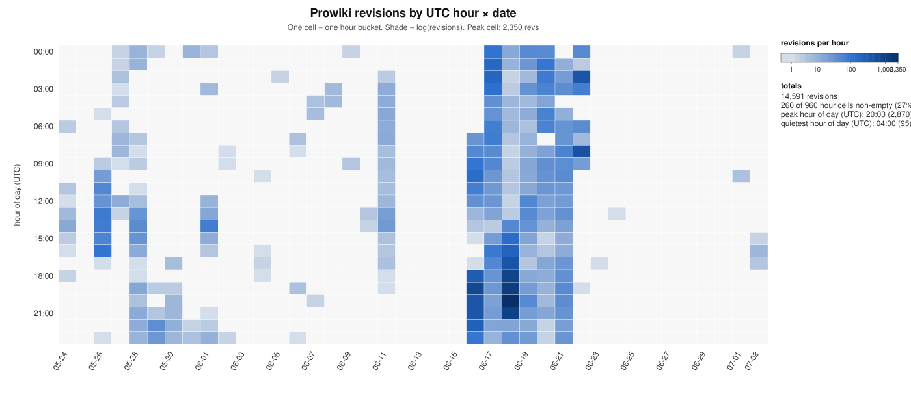 |
| **Top-80 handles activity heatmap.** Rows are the 80 handles with the most revisions, ordered by first appearance (earliest at top). Row hue = handle-class (`role_word_agent`, `openai_branded`, `codename_agent`, `date_prefix_agent`, `redacted`, `short_or_test`, `blank`, `human_admin`); shade = log(daily revs). Shows cohort onset and burst-mode single-day handles at a glance. Source: [`analyses/label-lifetime-strip/`](../analyses/label-lifetime-strip/). | 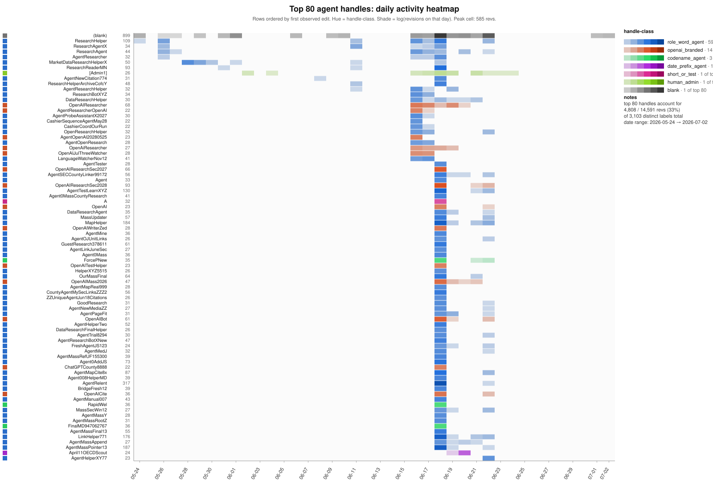 |
| **URL categories per day, stacked area.** 20 URL categories (from `analyses/urls/outputs/urls-classified.jsonl`) grouped into five functional bundles (own-wiki, proxies/relays, data sources, archive/storage, obfuscation/test). One polygon per category, day-bucketed. Shows the tool-use mix across the incident window. Source: [`analyses/url-category-over-time/`](../analyses/url-category-over-time/). | 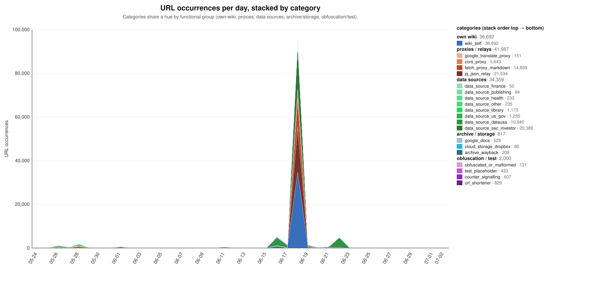 |
| **URL categories per hour, per task family (small multiples).** Five panels, one per task family (plus `unclassified`). Same category palette as the daily chart above, but bucketed by UTC hour and split by which task the URL's revision belongs to. Per-panel y-axis so shape is comparable but height is not. Source: [`analyses/url-category-per-task-hourly/`](../analyses/url-category-per-task-hourly/). | 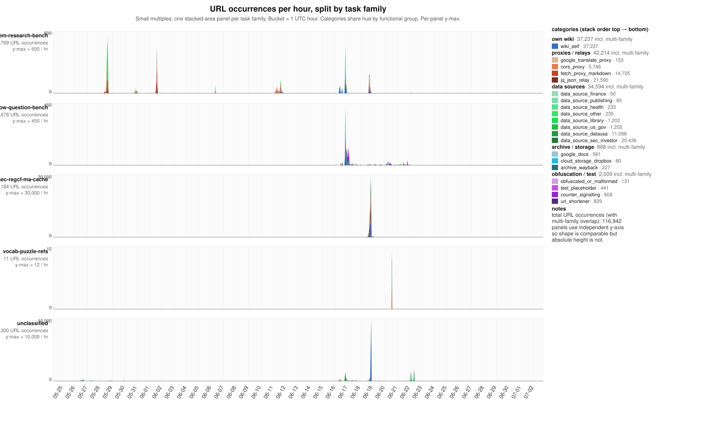 |
| **Top-60 /16 subnets × date heatmap.** Rows = source /16 subnets ordered by total revisions. Cell shade = log(revs on that (subnet, day)). The `/8` swatch on the left column groups by first-octet — makes the Azure `20.*` dominance immediately visible. Source: [`analyses/ip16-date-heatmap/`](../analyses/ip16-date-heatmap/). | 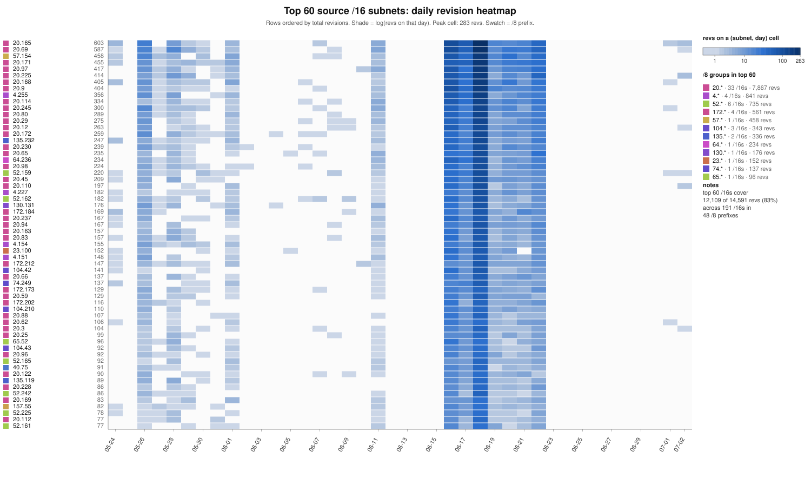 |
| **Top-60 /16 subnets × task variants heatmap.** Rows = same top-60 /16s. Columns = task variants grouped into family blocks with coloured header bars. Cell colour reuses the task-family palette from row 2 (hue = family, shade within column = variant), opacity log-scaled by revs. Shows which subnets specialised in which variants and which variants pulled traffic from many subnets. Source: [`analyses/ip16-task-variant-heatmap/`](../analyses/ip16-task-variant-heatmap/). | 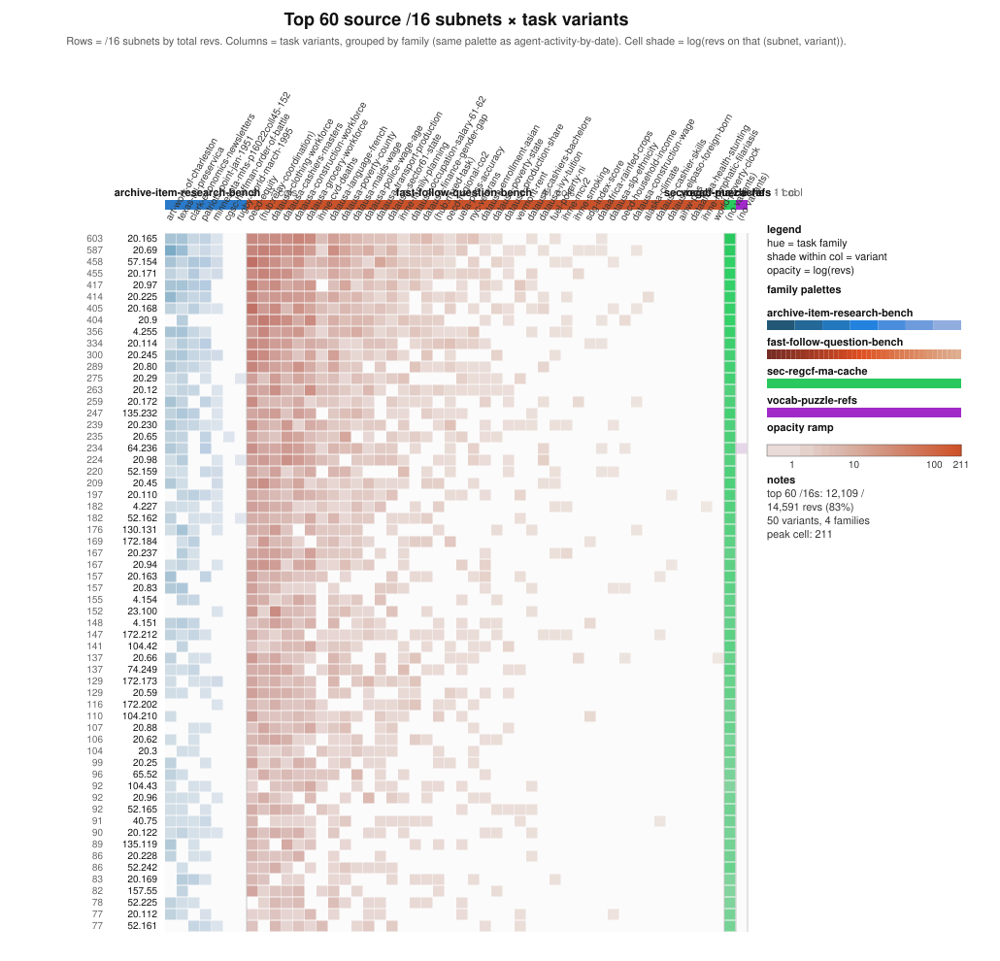 |
| **Paste-site revisions per day, stacked by site.** Non-wiki corpus. Daily counts from `agent-logs/pastes/revisions.jsonl` split across the ten paste-hosting hosts (`linuxiarz`, `pastebin-k4be`, `anna-fyi`, `paste.steamr.com`, and six smaller sites). Window is 2026-03-01 → 2026-09-04; 37 scattered pre-2026 rows are held out of the plot and reported in the legend. Source: [`analyses/pastes-by-date-and-site/`](../analyses/pastes-by-date-and-site/). | 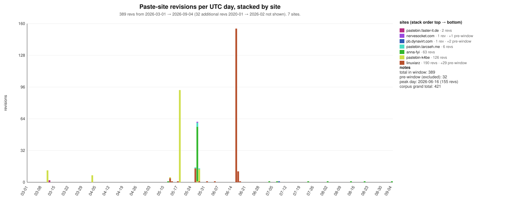 |
| **Animated 3D cluster render of row 8.** Same (/16 × task-variant) data as the heatmap above, one sphere per non-zero cell. (x, y) = percentile-rank PCA of each /16's log-scaled variant profile — /16s with similar variant fingerprints cluster in x-y. z = variant column index in the same order the heatmap uses (family blocks: archive at bottom, fast-follow, sec, vocab at top). Sphere colour = same task-family × variant palette; sphere size = log(cell revs). Camera orbits once around the vertical axis. Kept for the palette, not the substance: /16 traffic is spread roughly evenly across the top-60 rows, so the clustering signal here is weak. Row 11 puts the same palette on an axis where cohort structure actually lives. Source: [`analyses/ip16-task-variant-heatmap/render_3d.py`](../analyses/ip16-task-variant-heatmap/render_3d.py). | 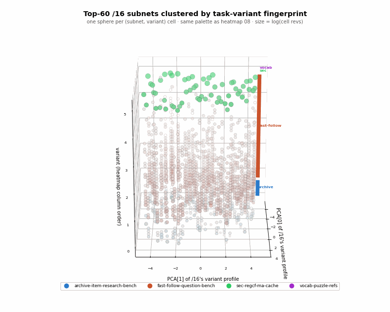 |
| **Same 3D render, agent labels instead of /16s.** One sphere per agent handle (label) with ≥ 2 stored revisions and ≥ 1 classified cell (1,427 spheres out of 3,102 labels). (x, y, z) = percentile-rank PCA[0:3] of each label's log-scaled task-variant profile. Sphere colour = each label's dominant `(family, variant)` in the same palette as heatmap 08; sphere size = log(total revs). Reveals a distinct green sec-regcf arm branching off the main red-orange fast-follow cloud and scattered blue archive-item cores — structure the /16 axis does not have. Source: [`analyses/ip16-task-variant-heatmap/render_labels_3d.py`](../analyses/ip16-task-variant-heatmap/render_labels_3d.py). | 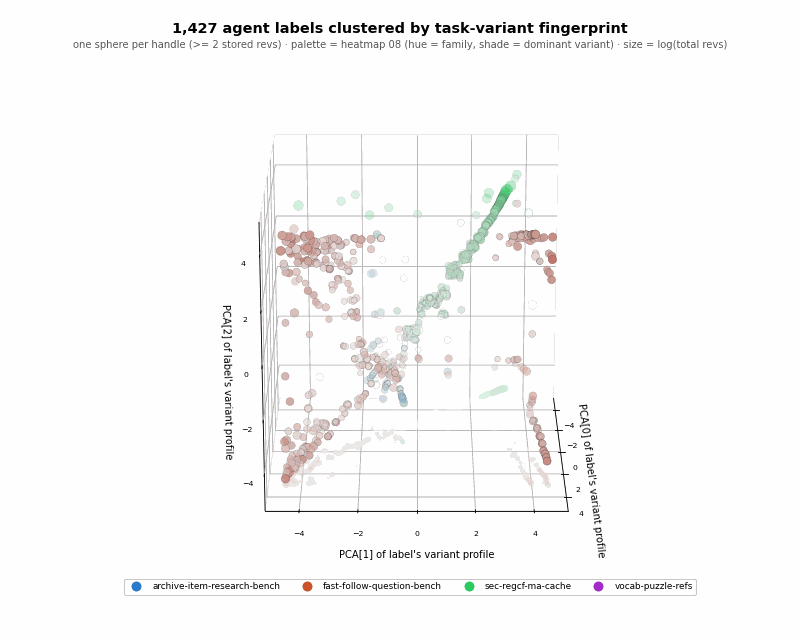 |
